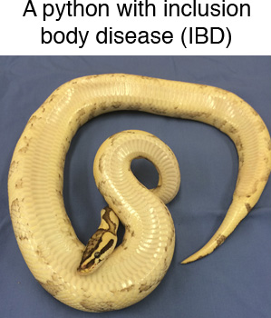

## Day 3 Metagenomics Exercise

Todos Santos Genomics and Bioinformatics 2022
---

## First: Install conda environment with software we'll need

Installing bioinformatics software can be challenging!  [Conda](http://anaconda.org) is a tool that facilitate installing software and making sure the installed software works together.  

You will create a new conda environment that includes the tools you'll need for the remainder of this exercise on the thoth01 server.  The tools are listed in [this file](https://github.com/stenglein-lab/2022_Todos_Santos/blob/main/exercises/bio_tools.yaml)

Login to the thoth01 server:
```
ssh your_usernam@thoth01.cvmbs.colostate.edu
```

The username and password are the same ones you've been using for the rna.biology.colostate.edu server.

Create a new conda environment named bio_tools by running this command
```
# download the yaml file from github
curl -OL https://raw.githubusercontent.com/stenglein-lab/2022_Todos_Santos/main/exercises/bio_tools.yaml

# create the conda environment
conda env create --file bio_tools.yaml
```

To activate this conda environment, you will need to run:
```
conda activate bio_tools
```

**You will need to activate this environment every time you want to use these tools.**


## Second: Downloading the data we need

## In this exercise, you will download, process, and evaluate NGS datasets and genome sequences.  You will:

* Download an NGS dataset from the SRA
* Use the FASTQC tool to assess the quality of the reads in the dataset
* Use cutadapt to remove low quality parts of the reads1
* Find and download genome sequences and associated annotation from NCBI

---

### Downloading an SRA dataset

We will work with one of the NGS datasets reported in [this paper](http://journals.plos.org/plospathogens/article?id=10.1371/journal.ppat.1004900)

This dataset was generated by performing shotgun sequencing of total RNA from the liver of a boa constrictor that was diagnosed with [inclusion body disease](https://en.wikipedia.org/wiki/Inclusion_body_disease). The dataset is composed of reads from host RNAs and from viral RNAs.  




To get the dataset, open a browser and navigate to the pubmed page for the dataset's paper:

https://www.ncbi.nlm.nih.gov/pubmed/25993603

Scroll down and find the 'Related information' section of the bottom right of the page.  Click on the SRA link.  This shows the SRA datasets associated with this paper.  Locate the dataset named `shotgun sequencing of tissue from snake_7`.  To download the NGS data, we need to note the accession number (SRR number) for this dataset, which is: SRR1984309.


We're going to download this dataset using the command line tool fastq-dump, part of the [SRA toolkit](https://trace.ncbi.nlm.nih.gov/Traces/sra/sra.cgi?view=toolkit_doc).  First, let's create a directory (folder) in which to work on the thoth01 server.. 

Move to your home directory:
```
# running cd with no options moves you to your home directory
cd
```

Make a new directory
```
mkdir snake_exercise
```

Move to that directory
```
cd snake_exercise
```

Confirm that you are in the correct directory:
```
pwd
```

We will download the dataset using the fastq-dump tool, part of the [SRA toolkit](https://trace.ncbi.nlm.nih.gov/Traces/sra/sra.cgi?view=toolkit_doc). 

To run fasta-dump, you just need to specify the run # (the SRR#) of the dataset you want.  Recall that our run # is SRR1984309. The --split-files option of the command will create 2, synchronized files for the paired reads

```
fastq-dump SRR1984309 --split-file
```

Confirm that you downloaded the files.  You should see files named SRR1984309_1.fastq and SRR1984309_2.fastq that are each 44 Mb.

```
ls -lh
```

Look at the first 20 lines of the fastq files using the head command
```
head -20 SRR1984309_1.fastq SRR1984309_2.fastq
```

**Questions:**
- What is on each of the 4-lines that make up each sequence?  (See: [FASTQ format](https://en.wikipedia.org/wiki/FASTQ_format))  
- The quality scores for this dataset are in Illumina 1.9 format.  What is the maximum quality score for each basecall?  How does that relate to the estimated probability that a basecall is wrong?
- How many reads are in each file?  (Hint: the `wc -l name_of_file` command will tell you the number of lines in the file)

---

### Using FastQC to evaluate quality of NGS data

[FastQC](https://www.bioinformatics.babraham.ac.uk/projects/fastqc/) is a tool that: 

> ... aims to provide a simple way to do some quality control checks on raw sequence data coming from high throughput sequencing pipelines. It provides a modular set of analyses which you can use to give a quick impression of whether your data has any problems of which you should be aware before doing any further analysis

Performing a quality check like this of your data is one of the first things you'll want to do when you receive your new sequencing data (or when you download a dataset from an online repository like the SRA).

FastQC can be used via a graphical interface or via the command line. On the command line, run fastq to perform a quality check on these datasets: 

```
fastqc SRR1984309_1.fastq SRR1984309_2.fastq
```

These datasets have already been pre-cleaned, so they look pretty good.  Note that there is possible Nextera adapter contamination towards the end of some reads.  This makes sense, because the libraries were made with the Nextera protocol.  In the next section, we will trim those off.

---

### Read trimming with cutadapt

MARKMARK
[Trimmomatic](http://www.usadellab.org/cms/?page=trimmomatic) is a tool that can be used to trim low quality and adapter sequences from NGS reads.  It's always a good idea to trim raw NGS reads.

Trimmomatic has _a lot_ of options, described [here](http://www.usadellab.org/cms/uploads/supplementary/Trimmomatic/TrimmomaticManual_V0.32.pdf)

We will run this command to trim our reads:

```
java -jar ~/Desktop/GDW_Apps/Trimmomatic-0.39/trimmomatic-0.39.jar PE  SRR1984309_1.fastq SRR1984309_2.fastq SRR1984309_1_trimmed.fastq SRR1984309_1_trimmed_unpaired.fastq SRR1984309_2_trimmed.fastq SRR1984309_2_trimmed_unpaired.fastq ILLUMINACLIP:../Desktop/GDW_Apps/Trimmomatic-0.39/adapters/NexteraPE-PE.fa:2:30:10 LEADING:20 TRAILING:20 SLIDINGWINDOW:4:20 MINLEN:60 
``` 


Breaking this down:
- Names of input and output files: SRR1984309_1.fastq etc.    
- Trim Nextera adapter sequences (ILLUMINACLIP:...NexteraPE-PE.fa:2:30:10)
- Remove low quality bases from the 5' ends of the reads (below quality 20) (LEADING:20)
- Remove low quality bases from the 3' ends of the reads (below quality 20) (TRAILING:20)
- Trim reads if internal low quality bases (SLIDINGWINDOW:4:20)
- Remove reads shorter than 60 bases (MINLEN:60)

After you've completed trimming, look to see that the trimmed files exist in your directory:

```
ls -lh
```

- how many reads remain in the trimmed fastq files?

Now, we can use fastqc to analyze the trimmed datasets:
```
fastqc SRR1984309_1_trimmed.fastq SRR1984309_2_trimmed.fastq
```

Transfer the fastq html files using sftp to your computer and open them html files in a browswer and answer these questions:

- How many reads remain after trimming?
- Did the quality of the basecalls improve?
- Did the trimming remove Nextera adapters?

Note: There are other trimming tools that you may find easier to use, such as BBTrim

---

### Downloading the boa constrictor genome.

The dataset we downloaded was created by sequencing a library made from boa constrictor liver RNA.  We will map the reads in this dataset to the boa constrictor genome sequence.

First, we need to *find* the boa constrictor genome.  As usual, there are few ways we could go about this:

1. navigate through the NCBI [Taxonomy database](https://www.ncbi.nlm.nih.gov/taxonomy/)
2. navigate through the NCBI [Genome database](https://www.ncbi.nlm.nih.gov/genome/)
3. navigate through another genome database, like [Ensembl](http://www.ensembl.org/index.html) or [UCSC](https://genome.ucsc.edu/) 
4. google 'boa constrictor genome sequence'  (not a terrible way to do it)

- Let's choose option 1, and go through the NCBI Taxonomy database.  Navigate to https://www.ncbi.nlm.nih.gov/taxonomy/
   - Search for `boa constrictor`.  
   - Click on Boa constrictor link, then click the Boa constrictor link again
   - You should see a table in the upper right corner showing linked records in various NCBI (Entrez) databases.
   - Click on the `Genome (1)` link in that table to go to the boa constrictor records in the NCBI Genome database 

   - The linked page should say 'No items found', because the boa constrictor genome isn't actually in the NCBI Genome database<sup>[1](#myfootnote1)</sup>.  However, there is a mitochondrial genome. Let's download that.
   - Click on "See also 1 organelle- and plasmid-only records matching your search"
   - In the Replicon Info table, note the link to the boa constrictor mtDNA genome sequence (NC_007398.1)
   - Click on this 'NC_007398.1' RefSeq link

Now we need to download the sequence.  We'll do this through the browser.  In the upper right hand corner of the page, note the 'Send' drop down 

- Click Send->Complete Record->File->Format[FASTA]->Create File

You should have downloaded a fasta file of ~19 kb, named sequence.fasta, or something like that.  

Now download the sequence in GenBank format too.  Note that this file is larger (~42 kb), because it contains annotation as well as the actual sequence.

Note that the downloaded files have unhelpful names: `sequence.fasta` and `sequence.gb` or similar.  Move these files into your snake_exercise folder and rename them something useful:

make sure you are in the snake_exercise folder
```
pwd
```

If you are not in the snake_exercise directory, you can change to their by running: 
```
cd ~/snake_exercise
```

use the mv command to move and rename the files (_change if downloaded names are different_)
```
mv ~/Downloads/sequence.fasta ./boa_mtDNA.fasta
mv ~/Downloads/sequence.gb ./boa_mtDNA.gb
```

You can use the cat (or less) commands to output the contents of these files:
```
# cat outputs the contents of a file all at once
cat boa_mtDNA.fasta
cat boa_mtDNA.gb

# less allows you to page through files
less boa_mtDNA.fasta
less boa_mtDNA.gb
```

Hint: press `space` to advance a page in less and press `q` to exit


We want these files in Geneious too.  Drag them into Geneious:  
 - Open Geneious
 - Create a new folder in Geneious 
 - Drag and drop these files into Geneious


### Additional, time-permitting exercises 

**1. Coverage and multiplexing calculations:**

You are interested in using NGS to study a collection of related bacterial isolates.  These bacteria have estimated genome sizes of 5 Mbp (5x10<sup>6</sup> bp).  You want to do whole genome sequencing of as many isolates as possible in a single Illumina MiSeq run using paired-end 250 base sequencing (i.e., each of the two paired reads will be 250 bp long).  MiSeq runs generate ~20 million read pairs per paired-end run.  

Questions:

  1. You would like to achieve 100x coverage for each genome.  How many genomes could you multiplex in your MiSeq run?  

  2. Imagine instead that you'll be doing single-end 150 base sequencing instead of paired-end 250 base sequencing.  How many isolates could you multiplex on a single MiSeq run now?


**2. Download another genome a different way:**

There isn't a boa constrictor genome in NCBI :cry:.  Let's download a bacterial genome instead: that of [_Chlamydia psittaci_](https://en.wikipedia.org/wiki/Chlamydophila_psittaci).  This will allow us to practice finding and downloading and processing a genome using slightly different approaches.

To find the _C. psittaci_ genome, we will go through the NCBI Genome database.  Navigate to:

https://www.ncbi.nlm.nih.gov/genome/

Search for `Chlamydia psittaci`. This will take you to the genome overview page for this organism. 

You will notice a number of things on this overview page: 
- There are actually 61 _C. psittaci_ genomes.  One of these has been designated a "Representative genome".  We'll download this one. 
- There are a number of paths to the actual genome sequence(s).  One simple path is at the top of the page, where there are links to "Download sequences in FASTA format."  
   - Hover over the link to download the genome sequence in FASTA format.  Note that this link points to this URL:

ftp://ftp.ncbi.nlm.nih.gov/genomes/all/GCF/000/204/255/GCF_000204255.1_ASM20425v1/GCF_000204255.1_ASM20425v1_genomic.fna.gz

[FTP](https://en.wikipedia.org/wiki/File_Transfer_Protocol) is a protocol for transferring files between computers.

If you click on this link, you can download it to your laptop through your browser.  You can also download it directly from the command line using a utility like [curl](https://en.wikipedia.org/wiki/CURL).  Open your browser and download the C. psittaci genome using curl:
```
curl -O ftp://ftp.ncbi.nlm.nih.gov/genomes/all/GCF/000/204/255/GCF_000204255.1_ASM20425v1/GCF_000204255.1_ASM20425v1_genomic.fna.gz
```

Confirm you've downloaded the genome sequence. You should see a file named: GCF_000204255.1_ASM20425v1_genomic.fna.gz.
```
ls -lh 
```

The .gz file extension means this file is gzipped (compressed). Decompress it using gunzip:
```
gunzip GCF_000204255.1_ASM20425v1_genomic.fna.gz
```

The file should now be named GCF_000204255.1_ASM20425v1_genomic.fna.gz, which should be 1.1 Mb uncompressed
```
ls -lh
```

Look at the first 10 lines of the file:
```
head GCF_000204255.1_ASM20425v1_genomic.fna
```

Look at the last 10 lines of the file:
```
tail GCF_000204255.1_ASM20425v1_genomic.fna
```
You can see that the file consists of a header line and the genome sequence, with no associated annotation.


#### Downloading genome annotation
You will note at the top of the overview page that you can also download annotation for this genome, either as an annotated version of the genome (in Genbank format), or as a file containing the annotations (in [GFF](https://en.wikipedia.org/wiki/General_feature_format), or tabular formats)

- Download the annotated genome in Genbank format, and drag and drop it into Geneious.  


<br>
<br>
<br>
<br>

---
Footnotes

<a name="myfootnote1">1</a>: The boa constrictor genome _was_ sequenced as part of the [Assemblathon 2 competition](https://www.ncbi.nlm.nih.gov/pubmed/23870653), and the (unannotated) assemblies can be found [here](http://gigadb.org/dataset/100060), which you can find by Google searching "boa constrictor genome".  So Google searching is not a bad idea.


## In this exercise, we will learn how to create an index from a reference sequence, then map reads to that reference sequence

### [Last time] Downloading an SRA dataset

Last week, you downloaded one of the NGS datasets reported in [this paper](http://journals.plos.org/plospathogens/article?id=10.1371/journal.ppat.1004900)

This dataset was generated by performing shotgun sequencing of total RNA from the liver of a boa constrictor that was diagnosed with [inclusion body disease](https://en.wikipedia.org/wiki/Inclusion_body_disease). 


You also used cutadapt to trim off low quality and adapter-derived parts of reads.

### Downloading the boa constrictor (mitochondrial) genome.

The NGS data we are working with came from boa constrictor liver RNA.  We will map the reads in this dataset to the boa constrictor mitochondrial genome sequence to demonstrate read mapping.

First, we need to *find* the boa constrictor mitochondrial genome sequence.  As usual, there are few ways we could go about this:

1. navigate through the NCBI [Taxonomy database](https://www.ncbi.nlm.nih.gov/taxonomy/)
2. navigate through the NCBI [Genome database](https://www.ncbi.nlm.nih.gov/genome/)
3. navigate through another genome database, like [Ensembl](http://www.ensembl.org/index.html) or [UCSC](https://genome.ucsc.edu/)
4. google 'boa constrictor genome sequence'  (not a terrible way to do it)

- Let's choose option 1, and go through the NCBI Taxonomy database.  Navigate to https://www.ncbi.nlm.nih.gov/taxonomy/
   - Search for `boa constrictor`.
   - Click on Boa constrictor link, then click the Boa constrictor link again
   - You should see a table in the upper right corner showing linked records in various NCBI (Entrez) databases.
   - Click on the `Nucleotide` link in that table to go to boa constrictor sequences in the NCBI Nucleotide database

   - There are ~600 boa constrictor nucleotide sequences in this database.  We want the mitochondrial genome, which happens to be the only nucleotide sequence in the NCBI RefSeq database.
   - Click on "RefSeq" filter on the left hand side of the page.
   - You should see a link to the boa constrictor mitochondrial genome sequence.
   - Click on this 'NC_007398.1' RefSeq link

Now we need to download the sequence.  We'll do this through the browser.  In the upper right hand corner of the page, note the 'Send' drop down

- Click Send->Complete Record->File->Format->FASTA->Create File

You should have downloaded a fasta file of ~19 kb, named sequence.fasta, or something like that.

Now download the sequence in GenBank format too.  Note that this file is larger (~42 kb), because it contains annotation as well as the actual sequence.

Note that the downloaded files have unhelpful names: `sequence.fasta` and `sequence.gb` or similar.  You need to do two things with these downloaded files:

1. Rename these files to something more descriptive than sequence.fasta and sequence.gb.  Rename these files to:

- boa_mtDNA.fasta
- boa_mtDNA.gb

2. We want these files in Geneious too.  Drag them into Geneious:
 - Open Geneious
 - Create a new folder in Geneious
 - Drag and drop these files into Geneious

3. Transfer these files to the thoth01 server so we can work with them there.  To do this use sftp:

```
# change to the directory on your laptop where these downloaded files are
cd directory_where_your_files_are

# open an sftp connection to thoth01
sftp your_eid@thoth01.cvmbs.colostate.edu

# once connected via sftp, use the put command to transfer the files
put boa_mtDNA*
```

Now open an ssh connection to thoth01:
```
ssh your_eid@thoth01.cvmbs.colostate.edu
```

Once connected to thoth01, use the `mv` command to move these files to the directory where your trimmed fasta files are.


### Once you have these files on the thoth01 server

Change to the directory where your trimmed fastq files are and make sure these new boa_mtDNA files are in the same directory.

Let's inpsect the contents of these files.  You can use the cat (or less) commands to output the contents of these files:
```
# cat outputs the contents of a file all at once
cat boa_mtDNA.fasta
cat boa_mtDNA.gb

# less allows you to page through files
less boa_mtDNA.fasta
less boa_mtDNA.gb
```

Hint: press `space` to advance a page in less and press `q` to exit

What is the difference between the genbank and FASTA format versions of this sequence?


### Create a bowtie index from the boa constrictor mitochondrial genome sequence

Read mapping tools map reads very quickly because they use pre-built indexes of the reference sequence(s).  We'll use the [Bowtie2](http://www.nature.com/nmeth/journal/v9/n4/full/nmeth.1923.html) mapper. Bowtie2 has a nice [manual](http://bowtie-bio.sourceforge.net/bowtie2/manual.shtml) that explains how to use this software. 

There are a variety of other good read mapping tools, such as [BWA](https://github.com/lh3/bwa) and [minimap2](https://github.com/lh3/minimap2), which works well for long read data or long sequences.

The first step will be to create an index of our reference sequence (the boa constrictor mitochondrial genome).

Make sure you are in the right directory (our working directory):
```
pwd
```

Now confirm that the boa constrictor mtDNA sequence file is there and in FASTA format: 
```
# should see: boa_mtDNA.fasta and 2 trimmed fastq (SRR1984309_1_trimmed.fastq SRR1984309_2_trimmed.fastq)
ls -lh    
```

Now, we'll use the bowtie2-build indexing program to create the index.  This command takes 2 arguments: 
(1) the name of the fasta file containing the sequence(s) you will index
(2) the name of the index (can be whatever you want)

```
# create a bowtie2 index.  Name it boa_mtDNA_bt_index
bowtie2-build boa_mtDNA.fasta boa_mtDNA_bt_index 
```

Confirm that you built the index.  You should see six files with names ending in bt2, like boa_mtDNA_bt_index.3.bt2
```
ls -lh
```

Note that this index building went very fast for a small genome like the boa mtDNA, but can take much longer (hours) for Gb-sized genomes.


### Mapping reads in the SRA dataset to the boa constrictor mitochondrial genome 

Now that we've created the index, we can map reads to the boa mtDNA.  We'll map our Trimmomatic-trimmed paired reads to this sequence, as follows:

```
bowtie2 -x boa_mtDNA_bt_index \
   -1 SRR1984309_1_trimmed.fastq \
   -2 SRR1984309_2_trimmed.fastq \
   --no-unal \
   --threads 8 \
   -S SRR1984309_mapped_to_boa_mtDNA.sam
```

Let's deconstruct this command line (note: the comments will screw up this command: don't copy and paste from this box): 
```
 bowtie2
   -x boa_mtDNA_bt_index         # -x: name of index you created with bowtie2-build
   -1 SRR1984309_1_trimmed.fastq      # name of the paired-read FASTQ file 1
   -2 SRR1984309_2_trimmed.fastq      # name of the paired-read FASTQ file 2
   --no-unal            # don't output unmapped reads to the SAM output file (will make it _much_ smaller
   --threads 8            # since the server has multiple processers, run on 8 processors to go faster
   -S SRR1984309_mapped_to_boa_mtDNA.sam   # name of output file in SAM format
```

- Some questions to consider:
  - What percentage of reads mapped to the boa mitochondrial genome?
  - Does this make sense biologically?  Remember that this is total RNA from snake liver tissue.


The output file SRR1984309_mapped_to_boa_mtDNA.sam is in [SAM format](https://en.wikipedia.org/wiki/SAM_(file_format)).  This is a plain text format, so you can look at the first 20 lines by running this command:


```
head -20 SRR1984309_mapped_to_boa_mtDNA.sam      
```

You can see that there are several header lines beginning with `@`, and then one line for each mapped read.  See [here](http://genome.sph.umich.edu/wiki/SAM) or [here](https://samtools.github.io/hts-specs/SAMv1.pdf) for more information about interpreting SAM files.

Answer the following questions about the first mapped read:
- What position in the mtDNA sequence did it map to?
- What is the mapping quality for this read's mapping?
- What does this mapping quality score indicate?  


### Visualizing aligned (mapped) reads in Geneious

Geneious provides a nice graphical interface for visualizing the aligned reads described in your SAM file.   Other tools for visualizing this kind of data include [IGV](http://software.broadinstitute.org/software/igv/) and [Tablet](https://ics.hutton.ac.uk/tablet/)

First, you need to transfer the SRR1984309_mapped_to_boa_mtDNA.sam file from thoth01 to your computer.  Use sftp or cyberduck to do this.

Second, you need to have your reference sequence in Geneious, preferably with annotations.  You can do this 2 ways:

1. Drag and drop the boa_mtDNA.gb file into a folder in Geneious
2. Download the file directly into Genious, using the NCBI->Nucleotide interface (search for NC_007398.1).  Once downloaded, drag from the NCBI download folder into another folder in Geneious.  

Once you have the boa constrictor mitochondrial genome in a folder in Geneious, you can drag and drop the SAM file that bowtie2 output into the same folder.  Geneious will tell you that it 'can't find the sequence it needs in the selected file'.  It is telling you it is trying to find the reference sequence to which you aligned reads.  Answer: 'Find a sequence with the same name in this Geneious folder' or 'Use one of the selected sequences' (after selecting the boa mtDNA sequence).

- A few Geneious tips:
  - Enlarge the Geneious window so that it fills the screen
  - Click View->Expand Document View to enlarge the alignment
  - Try playing with the visualization settings in the panels on the right of the alignment

- Some questions to consider when viewing the alignment:
  - What is the average coverage depth across the mitochondrial genome?
  - Is the coverage even across the mitochondrial genome?
  - Would you expect coverage to be even across the genome?  (Recall that this data is derived from total RNA from liver tissue). 
  - Are the mitochondrial genes expressed evenly?
  - Are there any variants between this snake's mitochondrial genome sequence and the boa constrictor reference sequence?
  - Is it expected that there are variants between these reads and this reference sequence?  Explain your answer.
  - Can you distinguish true variants from sequencing errors?
  - In general, how can you distinguish true variants from sequencing errors?
  - Is it possible that reads that derive from the boa constrictor nuclear genome are mapping to this sequence?
  - How would you prevent nuclear reads from mapping to the mitochondrial genome?
  - Can you identify mapped read pairs?
