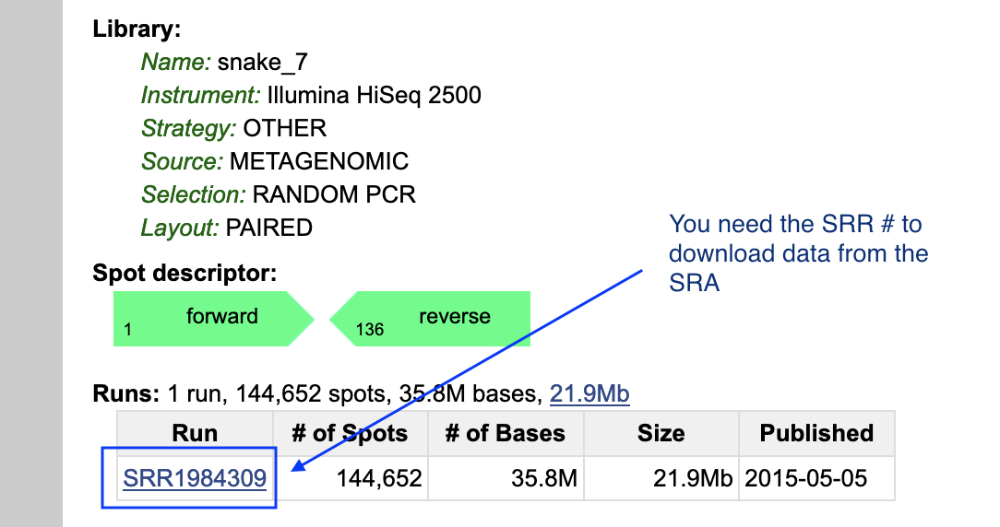
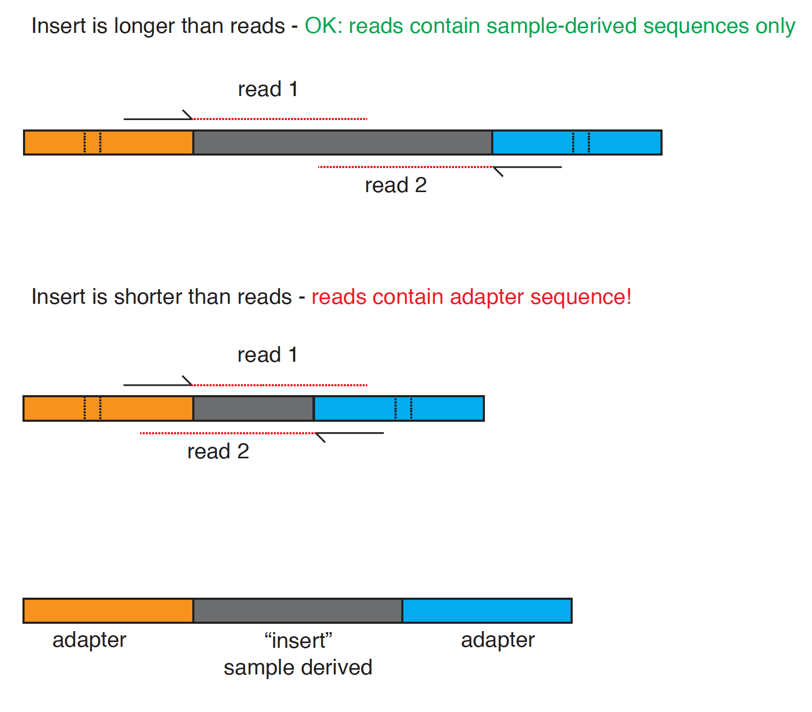

## Day 3 Metagenomics Exercise

Todos Santos Genomics and Bioinformatics 2022
---

Today we will perform a metagenomics workflow.  We will be working on a different server than the past two days.  This server's name is `thoth01.cvmbs.colostate.edu`

## First: Install conda environment with software we'll need

Installing bioinformatics software can be challenging!  We will again use [Conda](http://anaconda.org) to install the software we need.

You will create a new conda environment that includes the tools you'll need for the remainder of this exercise on the thoth01 server.  The tools are listed in [this file](https://github.com/stenglein-lab/2022_Todos_Santos/blob/main/exercises/bio_tools.yaml)

Login to the thoth01 server:
```
ssh your_username@thoth01.cvmbs.colostate.edu
```

The username and password are the same as for the `rna.biology.colostate.edu` server.

Create a new conda environment named bio_tools by running this command
```
# download the yaml file from github
curl -OL https://raw.githubusercontent.com/stenglein-lab/2022_Todos_Santos/main/exercises/bio_tools.yaml

# create the conda environment
conda env create --file bio_tools.yaml
```

To activate this conda environment, you will need to run:
```
conda activate bio_tools
```

**You will need to activate this environment every time you want to use these tools.**


## Second: Downloading the data we need

### Downloading an SRA dataset

We will work with one of the NGS datasets reported in [this paper](http://journals.plos.org/plospathogens/article?id=10.1371/journal.ppat.1004900)

This dataset was generated by performing shotgun sequencing of total RNA from the liver of a boa constrictor that was diagnosed with [inclusion body disease](https://en.wikipedia.org/wiki/Inclusion_body_disease). The dataset is composed of reads from host RNAs and from viral RNAs.  


To get the dataset, open a browser and navigate to the pubmed page for the dataset's paper:

https://www.ncbi.nlm.nih.gov/pubmed/25993603

Scroll down and find the 'Related information' section of the bottom right of the page.  Click on the SRA link.  This shows the SRA datasets associated with this paper.  Locate the dataset named `shotgun sequencing of tissue from snake_7`.  To download the NGS data, we need to note the accession number (SRR number) for this dataset, which is: SRR1984309.



We're going to download this dataset using the command line tool fastq-dump, part of the [SRA toolkit](https://trace.ncbi.nlm.nih.gov/Traces/sra/sra.cgi?view=toolkit_doc).  First, let's create a directory (folder) in which to work on the thoth01 server.. 

Move to your home directory:
```
# running cd with no options moves you to your home directory
cd
```

Make a new directory
```
mkdir snake_exercise
```

Move to that directory
```
cd snake_exercise
```

Confirm that you are in the correct directory:
```
pwd
```

We will download the dataset using the fastq-dump tool, part of the [SRA toolkit](https://trace.ncbi.nlm.nih.gov/Traces/sra/sra.cgi?view=toolkit_doc). 

To run fasta-dump, you just need to specify the run # (the SRR#) of the dataset you want.  Recall that our run # is SRR1984309. The --split-files option of the command will create 2, synchronized files for the paired reads

```
# download the NGS dataset from SRA run # SRR1984309
fastq-dump --split-files SRR1984309 
```

Confirm that you downloaded the files.  You should see files named SRR1984309_1.fastq and SRR1984309_2.fastq that are each 44 Mb.

```
ls -lh
```

Look at the first 20 lines of the fastq files using the head command
```
head -8 SRR1984309_1.fastq SRR1984309_2.fastq
```

**Questions:**
- What is on each of the 4-lines that make up each fastq sequence?  (See: [FASTQ format](https://en.wikipedia.org/wiki/FASTQ_format))  
- How many reads are in each file?  (Hint: the `wc -l name_of_file` command will tell you the number of lines in the file)

---

### Using FastQC to evaluate quality of NGS data

[FastQC](https://www.bioinformatics.babraham.ac.uk/projects/fastqc/) is a tool that: 

> ... aims to provide a simple way to do some quality control checks on raw sequence data coming from high throughput sequencing pipelines. It provides a modular set of analyses which you can use to give a quick impression of whether your data has any problems of which you should be aware before doing any further analysis

Performing a quality check like this of your data is one of the first things you'll want to do when you receive your new sequencing data (or when you download a dataset from an online repository like the SRA).

FastQC can be used via a graphical interface or via the command line. On the command line, run fastq to perform a quality check on these datasets: 

```
fastqc SRR1984309_1.fastq SRR1984309_2.fastq
```

These datasets have already been pre-cleaned, so they look pretty good.  Note that there is possible Nextera adapter contamination towards the end of some reads.  This makes sense, because the libraries were made with the Nextera protocol.  In the next section, we will trim those off.

---

### Read trimming 

NGS reads can have problems.  Two main problems are:

1. Often, NGS reads contain adapters sequences.  This happens when the library molecules are too short, and the sequence reads go all the way through the insert (the part of the library molecule derived from the sample) and into the opposite adapter.

 insert size" width="500"/>

2. Quality tends to decrease towards the ends of Illumina reads.  It is good to trim off low quality bases from the ends of reads.

[fastp](https://github.com/OpenGene/fastp) is a tool that can be used to trim low quality and adapter sequences from NGS reads.  

We will run this fastp command to trim our reads:

```
fastp -i SRR1984309_1.fastq -I SRR1984309_2.fastq -o SRR1984309_1_trimmed.fastq -O SRR1984309_2_trimmed.fastq --length_required 100
``` 

fastp automatically detects and removes adapter and low quality bases from NGS reads.

Here, we are also discarding reads shorter than 100 bases after trimming.

```
ls -lh
```

Now, we can use fastqc to analyze the trimmed datasets:
```
fastqc SRR1984309_1_trimmed.fastq SRR1984309_2_trimmed.fastq
```

Transfer the fastq html files using sftp to your computer and open them html files in a browswer and answer these questions:

- How many reads remain after trimming?
- Did the quality of the basecalls improve?
- Did the trimming remove Nextera adapters?

Note: There are many trimming tools. Other popular trimming tools include [BBDuk](https://jgi.doe.gov/data-and-tools/software-tools/bbtools/bb-tools-user-guide/bbduk-guide/) and [cutadapt](https://cutadapt.readthedocs.io/en/stable/).

---

### Downloading the boa constrictor genome.

The dataset we downloaded was created by sequencing a library made from boa constrictor liver RNA.  We will map the reads in this dataset to the boa constrictor genome sequence.

First, we need to *find* the boa constrictor genome.  As usual, there are few ways we could go about this:

1. navigate through the NCBI [Taxonomy database](https://www.ncbi.nlm.nih.gov/taxonomy/)
2. navigate through the NCBI [Genome database](https://www.ncbi.nlm.nih.gov/genome/)
3. navigate through another genome database, like [Ensembl](http://www.ensembl.org/index.html) or [UCSC](https://genome.ucsc.edu/) 
4. google 'boa constrictor genome sequence'  (not a terrible way to do it)

- Let's choose option 1, and go through the NCBI Taxonomy database.  Navigate to https://www.ncbi.nlm.nih.gov/taxonomy/
   - Search for `boa constrictor`.  
   - Click on Boa constrictor link, then click the Boa constrictor link again
   - You should see a table in the upper right corner showing linked records in various NCBI (Entrez) databases.
   - Click on the `Genome (1)` link in that table to go to the boa constrictor records in the NCBI Genome database 

   - The linked page should say 'No items found', because the boa constrictor genome isn't actually in the NCBI Genome database<sup>[1](#myfootnote1)</sup>.  However, there is a **mitochondrial** genome. Let's download that.
   - Click on "See also 1 organelle- and plasmid-only records matching your search"
   - In the Replicon Info table, note the link to the boa constrictor mtDNA genome sequence (NC_007398.1)
   - Click on this 'NC_007398.1' RefSeq link

Now we need to download the sequence.  We'll do this through the browser.  In the upper right hand corner of the page, note the 'Send' drop down 

- Click Send->Complete Record->File->Format[FASTA]->Create File

This will download this file in fasta format to your laptop.  You should have downloaded a fasta file of ~19 kb, named sequence.fasta, or something like that.  

Next, download the sequence in GenBank format too.  Note that this file is larger (~42 kb), because it contains annotation as well as the actual sequence.

Note that the downloaded files have unhelpful names: `sequence.fasta` and `sequence.gb` or similar.  Rename these files to NC_007398.fasta and NC_007398.gb

Use a text editor (Notepad++ or BBEdit or something similar) to inspect the files you've just downloaded.  Note that the fasta file does not have any annotation, but the genbank file does.  As we will see, both of these formats will be useful.

Use Cyberduck or FileZilla to transfer these files to the server and move them to the snake_exercise directory.

At this point, you should be on the thoth01 server in the snake_exercise folder and there should be a file named `NC_007398.fasta`
```
# should be in snake_exercise folder
pwd

# should see a 19 kb file named NC_007398.fasta
ls -lh 
```

## Map reads to the boa constrictor mitochondrial genome

Now we will learn how to map reads to a reference sequence.  Read mapping is fundamental to a variety of analyses, including RNA-Seq, SNP identification (variant calling), etc.


### Create a bowtie index from the boa constrictor mitochondrial genome sequence

Read mapping tools map reads very quickly because they use pre-built indexes of the reference sequence(s).  We'll use the [Bowtie2](http://www.nature.com/nmeth/journal/v9/n4/full/nmeth.1923.html) mapper. Bowtie2 has a nice [manual](http://bowtie-bio.sourceforge.net/bowtie2/manual.shtml) that explains how to use this software. 

There are a variety of other good read mapping tools, such as [BWA](https://github.com/lh3/bwa) and [minimap2](https://github.com/lh3/minimap2), which works well for long read data or long sequences.

The first step will be to create an index of our reference sequence (the boa constrictor mitochondrial genome).

Now, we'll use the bowtie2-build indexing program to create the index.  This command takes 2 arguments: 
(1) the name of the fasta file containing the sequence(s) you will index
(2) the name of the index (can be whatever you want)

```
# create a bowtie2 index.  Name it NC_007398_bt_index
bowtie2-build NC_007398.fasta NC_007398_bt_index 
```

Confirm that you have successfuly built the index.  Bowtie2 indexes are actually composed of 6 files.  You should see six files with names ending in bt2, like NC_007398_bt_index.3.bt2
```
# should see six bowtie2 index files
ls -lh
```

Note that this index building went very fast for a small genome like the boa mtDNA, but can take much longer (hours) for Gb-sized genomes.  But at least you only need to build an index once per reference sequence.

### Mapping reads in the SRA dataset to the boa constrictor mitochondrial genome 

Now that we've created the index, we can map reads to the boa mtDNA.  We'll map our fastp-trimmed paired reads to this sequence, as follows:

```
bowtie2 -x NC_007398_bt_index \
   -1 SRR1984309_1_trimmed.fastq \
   -2 SRR1984309_2_trimmed.fastq \
   --no-unal \
   --threads 8 \
   -S SRR1984309_mapped_to_NC_007398.sam
```

Let's deconstruct this command line:

Option | Meaning
--- | ---
-x NC_007398_bt_index   |  -x: name of index you created with bowtie2-build
-1 SRR1984309_1_trimmed.fastq   | name of the paired-read FASTQ file 1
-2 SRR1984309_2_trimmed.fastq   | name of the paired-read FASTQ file 2
--no-unal   | don't output unmapped reads to the SAM output file (this will make the sam file _much_ smaller)
--threads 8   | since this server has multiple processers, run on 8 processors to go faster
-S SRR1984309_mapped_to_NC_007398.sam   | name of output file in SAM format

Bowtie will output some information about what percentage of the reads aligned.
 - What percentage of the reads aligned to the boa constrictor mitochondrial genome? (What is the overall alignment rate?)
 - Does that number make sense?

The main output file from bowtie (and other read mappers) is a file in [sam format](https://en.wikipedia.org/wiki/SAM_(file_format)), which describes how reads aligned to the reference sequence.  The output file from our command is `SRR1984309_mapped_to_NC_007398.sam`

Sam is a plain text format, so you can look at the first 20 lines by running this command:

```
head -20 SRR1984309_mapped_to_NC_007398.sam
```

You can see that there are several header lines beginning with `@`, and then one line for each mapped read.  See [here](http://genome.sph.umich.edu/wiki/SAM) or [here](https://samtools.github.io/hts-specs/SAMv1.pdf) for more information about interpreting SAM files.

Answer the following questions about the first mapped read:
- What position in the mtDNA sequence did it map to?
- What is the mapping quality for this read's mapping?
- What does this mapping quality score indicate?  


### Visualizing aligned (mapped) reads in Tablet

Looking at SAM files is OK, but it can be helpful to inpsect mapped reads visually.

We will use [Tablet](https://ics.hutton.ac.uk/tablet/) to visualize the reads we mapped to the boa constrictor mitochondrial genome.

Other tools for visualizing this kind of data include [Geneious](https://www.geneious.com/) and [IGV](http://software.broadinstitute.org/software/igv/)

First, we need to transfer the .sam file from the server to your desktop.  Transfer SRR1984309_mapped_to_NC_007398.sam to your laptop using Cyberduck of FileZilla.  


#### Load mapped reads into Tablet:

You will need to load 3 pieces of information into Tablet: 
1. The mapped reads in SAM format
2. The reference sequencein FASTA format
3. Annotation in gff3 format

To do this, open Tablet and:  
- Click 'Open Assembly'.  
  - For the Primary assembly file: use the SRR1984309_mapped_to_NC_007398.sam file you just downloaded.   
  - For the Reference/consensus file: use the fasta formatted file for NC_007398 that you downloaded from Genbank.  (Also here: [NC_007398.fasta](https://raw.githubusercontent.com/stenglein-lab/2018_Todos_Santos/master/exercises/NC_007398.fasta) )

- Click 'Import Features'.  Open the NC_007398.gff3 file you downloaded from Genbank earlier.  (Also here: [NC_007398.gff3](https://raw.githubusercontent.com/stenglein-lab/2018_Todos_Santos/master/exercises/NC_007398.gff3) )

- Customize the view in Tablet by:
  - right click on the read coverage graph at the top of the window and select Coverage Overview
  - click on the Features tab (an upside down triangle) near the top left of the window and click "Select tracks"
    - turn on the TRNA, RRNA, and GENE tracks
  - Use the zoom slider to zoom in and out

Some questions to consider when viewing the alignment:
 - Is the coverage even across the mitochondrial genome?  What is the average coverage?  
 - This is essentially RNA-Seq data.  Are the mitochondrial genes expressed evenly?  How does this relate to coverage?
 - Are there any variants between this snake's mitochondrial genome sequence and the boa constrictor reference sequence?  Is that expected?
   - Can you distinguish true variants from sequencing errors?
   - Hint: click Color Schemes -> Variants to highlight the variant bases 
 - Can you identify mapped read pairs?  


## De novo assembly

We have practiced mapping to a reference sequence.  Imagine that we don't have a reference sequence.  In that case, we'd need to perform de novo assembly.  


**Genome assembly is like doing a jigsaw puzzle when you don't know what the picture looks like.  Image credit: Keith Bradnam, UC Davis**

There are a variety of de novo assemblers with different strengths and weaknesses.  We're going to use the [SPAdes assembler](http://cab.spbu.ru/software/spades/) to assemble the reads in our dataset that don't map to the boa constrictor genome. First, let's map the reads in our dataset to the _entire_ boa constrictor genome, not just the mitochondrial genome.

The instructors have already downloaded an assembly of the boa constrictor genome from [here](http://gigadb.org/dataset/100060) and made a bowtie2 index, which can be found in the TodosSantos directory in your home directories.  We could have you make an index yourself, but that would take a long time (~30 min) for a Gb genome like the boa constrictor's.  The boa constrictor genome index is named boa_constrictor_bt_index.

First, let's move the bowtie index to your working folder:
```
# on the thoth01 server change to the right directory
cd ~/snake_exercise    

# copy the boa constrictor bowtie index from Mark's home directory to the current directory (.)
cp /home/mdstengl/TodosSantos/boa_constrictor_bt_index* .
```

Now, we'll run bowtie2 to map reads to the *entire* boa genome.  This time we'll run bowtie2 a little differently:
1. We'll run bowtie2 in [local mode](http://bowtie-bio.sourceforge.net/bowtie2/manual.shtml#end-to-end-alignment-versus-local-alignment), which is a more permissive mapping mode that doesn't require the ends of the reads to map
2. We'll keep track of which reads _did not_ map to the genome using the --un-conc option

```
bowtie2 -x boa_constrictor_bt_index --local \
   -q -1 SRR1984309_1_trimmed.fastq  -2 SRR1984309_2_trimmed.fastq \
   --no-unal --threads 4 -S SRR1984309_mapped_to_boa_genome.sam --un-conc SRR1984309_not_boa_mapped.fastq
```

You should see that ~90% of the reads aligned to the boa constrictor genome sequence (overall alignment rate), leaving ~10% in the files that contain the non-mapping reads: `SRR1984309_not_boa_mapped.1.fastq` and `SRR1984309_not_boa_mapped.2.fastq`

How many non-mapping reads remain in these files?

We will use these non-mapping reads as input to our de novo SPAdes assembly.  Run SPAdes as follows:

```
spades.py   -o SRR1984309_spades_assembly \
   --pe1-1 SRR1984309_not_boa_mapped.1.fastq \
   --pe1-2 SRR1984309_not_boa_mapped.2.fastq \
   -m 12 -t 4
```

Command line options explained:

Option   |Meaning
------   |-------
-o  SRR1984309_spades_assembly |name of directory (folder) where SPAdes output will go
--pe1-1 SRR1984309_not_boa_mapped.1.fastq |name of read1 input file
--pe1-2 SRR1984309_not_boa_mapped.2.fastq |name of read2 input file
-m 12 -t 4 |use 12 Gb of RAM and 4 cores 

SPAdes will output a bunch of status messages to the screen as it runs the assembly.  

After SPAdes finishes, there will be output files in the `SRR1984309_spades_assembly` folder.  Change to that directory and look at the files.  

```
cd SRR1984309_spades_assembly
ls -lh
```

The key Spades output files are:

- contigs.fasta:   the assembled contigs in FASTA format
- scaffolds.fasta: scaffolds in FASTA format
- assembly_graph.fastg:   de bruijn graphs used to create contigs.  Can be visualized using a tool like [Bandage](https://rrwick.github.io/Bandage/)

Let's look at the contigs in contigs.fasta:  

```
less contigs.fasta
```

The contigs are sorted in order of length.  Recall that these are contigs made from the reads that _didn't_ map to the boa constrictor genome. Let's try to figure out what some of the contigs are.

Copy the first 3 contigs (the 3 longest contigs). Here is a command to get the first 3 contigs in one sequence per line fasta format:
```
seqtk seq -A contigs.fasta | head -6 
```

Now, open a browser, navigate to the [NCBI blastn page](https://blast.ncbi.nlm.nih.gov/Blast.cgi?PROGRAM=blastn&PAGE_TYPE=BlastSearch&LINK_LOC=blasthome), and paste the sequences of the first 3 contigs into the search field.  Make sure that the megablast option is selected, and run the BLAST.  

- What are the sequences?  Are you confident in your conclusions?  Do they make sense?


### Annotation:

Viral genomes are small and easy to annotate compared to larger genomes like bacterial or eukaryotic genomes.  Let's identify open reading frames in the viral genome sequences you identified.  Do this by pasting the viral contigs one at a time into NCBI's ORF finder software, [here](https://www.ncbi.nlm.nih.gov/orffinder/).  Set the minimum ORF size to 300 bp.

This is a snake-infecting arenavirus.  The expected structure of arenavirus genome segments can be seen on [this page](https://viralzone.expasy.org/501).  Can you find the expected genes in the Large and Small virus genome segments?

To validate that you have identified the expected ORFs (genes), copy the predicted protein sequences and use the [BLASTP](https://blast.ncbi.nlm.nih.gov/Blast.cgi?PROGRAM=blastp&PAGE_TYPE=BlastSearch&BLAST_SPEC=&LINK_LOC=blasttab&LAST_PAGE=blastn) tool to identify the most closely related protein sequences in NCBI.


#### Additional, time-permitting exercise

**Assembly validation:**

To quote [Miller et al](https://www.ncbi.nlm.nih.gov/pmc/articles/PMC2874646/), the Spades contigs are only "putative reconstructions" of the sequences from which the reads derived.  How could we validate these sequences as being accurate?

One way would be to use another sequencing technology, like PCR and Sanger sequencing.

Another way to validate an assembly is to re-map reads back to it using a mapping tool like bowtie.  This might reveal errors in the assembly, or mis-assemblies.  

If time permits, use what you've learned and re-map reads back to these contigs.  To do this, you'll have to create a new bowtie index (e.g. of the 1st 2 or 3 contigs) using bowtie2-build, then use bowtie2 to map reads.  Then you can visualize the aligned reads in Tablet.  Can you find any problems with the assemblies?


<br>
<br>
<br>
<br>

---
Footnotes

<a name="myfootnote1">1</a>: The boa constrictor genome _was_ sequenced as part of the [Assemblathon 2 competition](https://www.ncbi.nlm.nih.gov/pubmed/23870653), and the (unannotated) assemblies can be found [here](http://gigadb.org/dataset/100060), which you can find by Google searching "boa constrictor genome".  So Google searching is not a bad idea.


